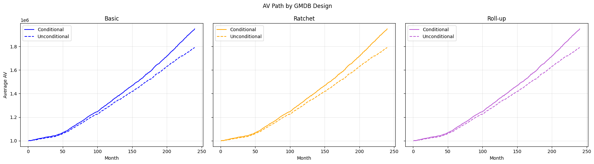
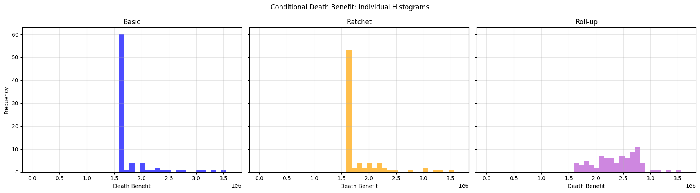
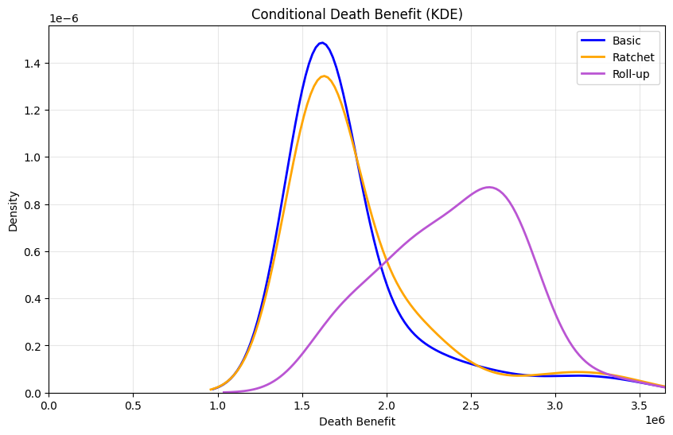
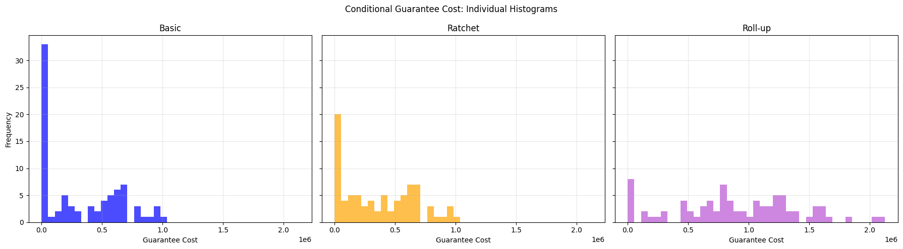
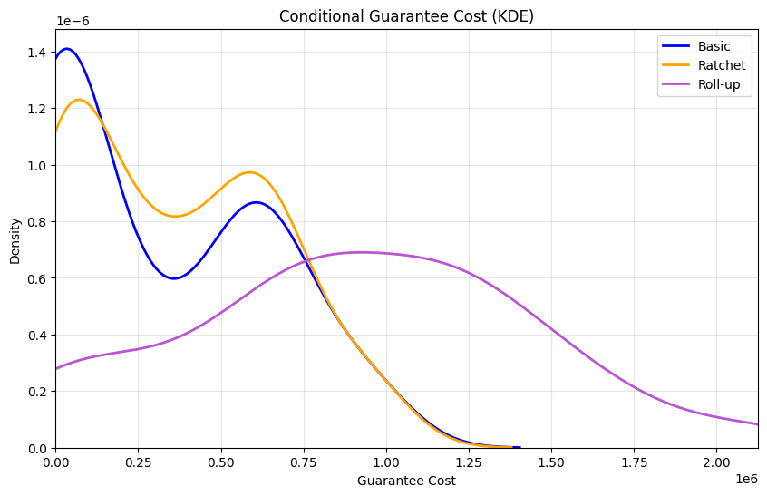
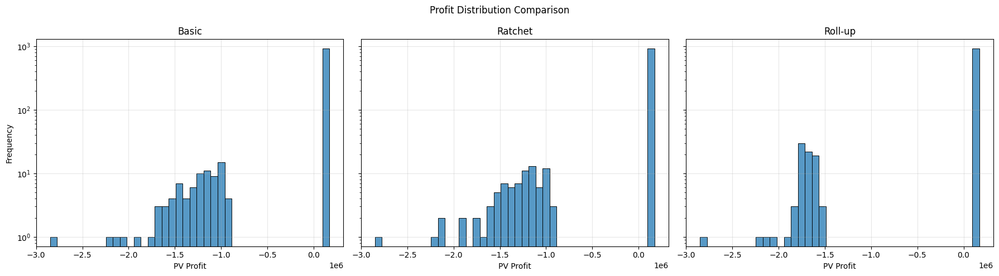

# GMDB Simulation & Valuation (Investment-Linked Insurance)

## 📌 Project Overview

### 本專案建立一個投資型壽險（Investment-Linked Insurance）之模擬模型，分析不同 GMDB（Guaranteed Minimum Death Benefit）設計對保單風險、成本與利潤的影響。透過 Monte Carlo 模擬與 Risk-Neutral 定價，本專案從Real-world simulation及Risk-neutral valuation兩個角度分析產品。
---

## 🎯 Objectives

- 比較不同 GMDB 設計（Basic / Ratchet / Roll-up）
- 分析關鍵指標：
  - Account Value (AV)
  - Death Benefit (DB)
  - Guarantee Cost (GC)
  - Tail Risk
  - Profit Distribution
- 評估產品設計對風險與經濟成本的影響
- 使用 risk-neutral 方法衡量保證的市場一致價值

---

## 🧩 Model Framework

### Simulation Flow
Fund Return Simulation
↓
Account Value (AV)
↓
Mortality Event
↓
Death Benefit (DB)
↓
Guarantee Cost (GC)
↓
Profit Calculation

---

## 🏗 GMDB Design

### 1. Basic
- 固定保證（例如：160 萬）
- 結構最簡單，成本最低

### 2. Ratchet
- 鎖定過去最高 AV
- 提供額外保障，但成本增加有限

### 3. Roll-up
- 保證隨時間成長
- 顯著提高 guarantee 成本與風險

---

## 📊 Key Results

### 1. Account Value (AV)

- 三種設計 AV 路徑相同 (因目前保證結構設計不影響投資績效、Fee、COI)
    

---

### 2. Death Benefit (DB)
- 高 AV 情境：三者趨於一致
- 低 AV 情境：差異顯著（Roll-up 最高）

| Metric                           | Basic          | Ratchet        | Roll-up        |
|:---------------------------------|:---------------|:---------------|:---------------|
| Conditional Mean Death Benefit   | 1,825,812.1478 | 1,866,651.6769 | 2,412,352.2847 |
| Conditional Median Death Benefit | 1,600,000.0000 | 1,600,000.0000 | 2,456,184.9075 |
| Conditional P95 Death Benefit    | 3,004,062.7230 | 3,017,255.3892 | 3,011,555.8759 |
| Conditional P99 Death Benefit    | 3,651,355.1438 | 3,651,355.1438 | 3,651,355.1438 |

---

### 3. Guarantee Cost (GC)

- Basic < Ratchet < Roll-up
- Roll-up 顯著增加 tail risk

| Metric                                     | Basic        | Ratchet      | Roll-up        |
|:-------------------------------------------|:-------------|:-------------|:---------------|
| Conditional Mean Guarantee Cost            | 320,104.0512 | 360,943.5802 | 906,644.1881   |
| Conditional Trigger Rate                   | 0.6829       | 0.8171       | 0.9268         |
| Conditional P95 Guarantee Cost             | 916,126.4385 | 916,126.4385 | 1,662,081.2362 |
| Conditional P99 Guarantee Cost             | 977,597.9856 | 977,597.9856 | 2,125,561.9181 |
| Worst 5% Mean Guarantee Cost (Conditional) | 954,618.2510 | 954,618.2510 | 1,955,866.0768 |

---

### 4. Tail Risk

- 保單具有明顯 tail risk
- 少數情境產生極端虧損
- Roll-up 放大下檔風險

---

## 💰 Profit Analysis

| Design | Mean Profit |
|--------|------------|
| Basic | Positive |
| Ratchet | Slightly lower |
| Roll-up | Negative |

 
 | Metric    |            Basic |          Ratchet |          Roll-up |
|:----------|-----------------:|-----------------:|-----------------:|
| mean      |  16925.4         |  14559.2         | -18722.2         |
| median    | 131455           | 131455           | 131455           |
| p5        |     -1.14582e+06 |     -1.17861e+06 |     -1.67309e+06 |
| p95       | 152408           | 152408           | 152408           |
| p99       | 164026           | 164026           | 164026           |
| loss_prob |      0.082       |      0.082       |      0.082       |

### Insights

- 大部分情境下保單穩定獲利（median 高）
- 少數情境產生巨大虧損（tail risk）
- Roll-up 出現 underpricing

👉 結構類似：
Small Gain (frequent) + Large Loss (rare)

---

## 📈 Risk-Neutral Valuation

| Design | Guarantee Value |
|--------|---------------|
| Basic | Low |
| Ratchet | Slightly higher |
| Roll-up | Significantly higher |

### Interpretation

- GMDB ≈ Embedded Put Option
- Roll-up 顯著提高 option value
- 成本主要來自 downside risk

---

## 🔍 Real-world vs Risk-neutral

| Perspective | Meaning |
|------------|--------|
| Real-world | 實際會發生什麼 |
| Risk-neutral | 市場覺得值多少 |

👉 兩者互補，用於：

- Profit analysis
- Pricing
- Risk management

---

## 💡 Key Insights

- GMDB 設計影響 tail risk，而非平均報酬
- Ratchet 是低成本保障升級
- Roll-up 顯著增加風險與成本
- 保單結構類似 short put payoff

---

## ⚠️ Practical Implications

- Roll-up 需更高費率或 hedge
- Ratchet 可作為平衡風險與吸引力的設計
- Risk-neutral valuation 可用於：
  - 定價
  - 避險成本評估

---

## 📌 Conclusion

GMDB 商品的核心風險來自於下檔保障機制。  
不同設計對平均結果影響有限，但對尾端風險與經濟成本具有決定性影響。

👉 本研究顯示：

> 產品設計的關鍵在於控制 tail risk，而非提升平均報酬。

---
